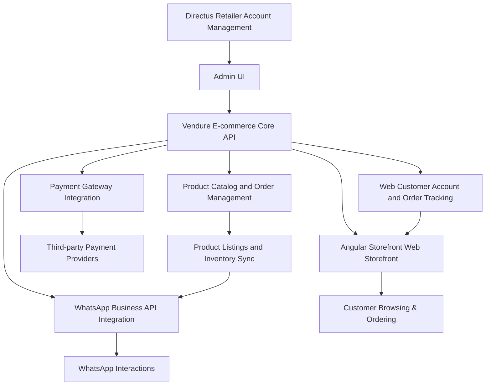

# **施工報告 - 電商平台開發專案**

### **專案名稱：**  
WhatsApp + Web Storefront 電商平台開發

### **報告日期：**  
2024年10月

---

## **1. 專案概述**

本專案旨在開發一個整合 WhatsApp 與 Web 的多平台電子商務系統，通過 WhatsApp Business API 與 Vendure 電商核心進行深度整合，並提供完善的產品目錄、庫存管理、訂單管理、以及多語言支持，為零售商和消費者提供便捷的購物體驗。

### **系統主要功能**

- **WhatsApp Storefront**：消費者可通過 WhatsApp 查看產品、下單購買。
- **Web Storefront**：基於 Vendure Angular Storefront 建立的網頁購物平台，支持產品瀏覽、訂單處理及支付。
- **產品與庫存管理**：通過 Vendure 提供統一的產品目錄與庫存管理，並與 WhatsApp 及 Web 平台同步。
- **多語言支持**：系統支持繁體中文、簡體中文及英文三種語言。
- **支付整合**：支持第三方支付平台如 Stripe、PayPal 等，提供多種支付方式。

---

## **2. 系統架構**

本系統的技術架構如下：

---

## **3. 開發範圍與任務**

### **1. WhatsApp Business API 整合**
- 註冊及設定 WhatsApp Business API
- 接收消息並回應（如產品目錄、訂單確認等）
- 自動化聊天流程設計（如產品推薦、訂單生成）
- 與 Vendure 的產品目錄、庫存及訂單系統對接

### **2. Vendure 電商核心 API**
- 設定及配置 Vendure 作為電商核心 API
- 擴展 Vendure API 以支持 WhatsApp 和 Web Storefront
- 資料模型及多語言支持的設計

### **3. 產品管理系統**
- 商品列表、庫存管理整合 Vendure 系統
- 使用 Directus 作為零售商帳戶管理後台系統的整合

### **4. Web Storefront 開發**
- 使用 Vendure Angular Storefront 建立前端界面
- 統一模板系統允許零售商自訂品牌元素

### **5. 支付系統整合**
- 整合第三方支付平台
- 訂單生成與支付連結發送功能

### **6. 測試與部署**
- 測試完整購物流程，確保 API、支付、庫存與訂單功能順暢運作
- 部署至生產環境，進行性能測試與優化

---

## **4. 預估工期與人天估算**

### **人天估算：**

| 開發任務                      | 所需人天    | 備註                                                  |
| ------------------------- | --------- | --------------------------------------------------- |
| **WhatsApp API 設定與整合**       | 20-25     | 學習、配置 WhatsApp API，並與 Vendure 產品目錄及訂單系統整合 |
| - 註冊與設置                  | 5-7       | 註冊 WhatsApp Business API 並進行初步設置                     |
| - 消息處理與自動化聊天流程設計    | 7-9       | 開發產品推薦及訂單生成自動化流程                               |
| - 與 Vendure 整合               | 8-9       | 同步產品目錄、訂單及庫存資訊                                |
| **Vendure 核心系統設定**          | 20-25     | 配置及擴展 Vendure，處理多語言支持和與 Directus 整合              |
| - 系統架構與資料模型設計           | 7-9       | 設計 Vendure 資料模型，適應多語言支持及產品類別管理                |
| - API 擴展與整合                  | 6-8       | 擴展 Vendure API，支援多平台同步                                   |
| - 與 Directus 整合                | 7-8       | 與 Directus 系統進行資料同步和帳戶管理整合                            |
| **Web Storefront 開發**           | 20-25     | 使用 Angular Storefront 構建前端系統，與後端整合                  |
| - Angular Storefront 設定與開發    | 10-12     | 使用 Angular Storefront 構建 Web 商店並整合 Vendure 核心            |
| - 前端 UI/UX 設計與開發            | 5-7       | 設計並開發前端界面，確保用戶體驗優良                                   |
| - 訂單管理及產品展示開發            | 5-6       | 構建訂單管理、產品展示、過濾和搜尋功能                                |
| **支付平台整合**                  | 12-15     | 整合第三方支付平台，處理支付流程並與訂單系統連接                    |
| - Stripe/PayPal/Alipay 整合        | 7-9       | 集成支付網關並處理訂單生成與支付連接                                 |
| - 支付安全與交易驗證               | 5-6       | 驗證支付安全性並進行交易數據處理                                     |
| **多語言支持**                   | 5-8       | 確保多語言支持（繁體中文、簡體中文、英文），處理翻譯及內容管理              |
| - 多語言內容管理                 | 2-3       | 管理翻譯內容及界面文本                                                 |
| - 系統多語言配置                 | 3-5       | 配置系統支援多語言並進行測試                                            |
| **測試與調整**                   | 10-15     | 測試、修復 bug、驗證多平台同步與支付流程                             |
| - 單元測試及整合測試              | 5-7       | 測試 API 整合、後台功能及多語言支持                                   |
| - 用戶流程測試                   | 3-5       | 測試前端用戶購物流程及支付流程                                         |
| - 問題修復及優化                 | 2-3       | 修復開發過程中的問題並優化功能                                         |
| **部署與性能優化**               | 5-7       | 上線並進行性能測試和優化                                             |
| - 部署到生產環境                 | 2-3       | 將系統部署到生產環境並進行基礎測試                                     |
| - 性能測試與優化                 | 3-4       | 測試系統性能並進行必要優化                                            |

預估總人天：120-150 人天

---

## **5. 人力配置建議**

1. **後端/支付系統工程師**（3人，負責 Vendure 電商核心、WhatsApp API 整合、支付平台整合以及系統擴展。這些任務可以在團隊內部互相支持，靈活分配資源。）

2. **全端/前端工程師**（2人，負責 Angular Storefront 前端開發及 Web Storefront 與後端系統的整合。）

3. **PM / 測試人員**（1人，負責專案管理及系統功能測試，確保開發流程順利進行並修正問題，說明文件。）

---

## **6. Roadmap 時間計劃**

### **階段 1：需求分析與架構設計**
- **時間預估：** 1-2 週
- **任務：**
  - 確定所有細化需求（包括功能、語言支持等）
  - 制定技術架構設計，確認與第三方服務的集成細節

### **階段 2：技術探索與學習**
- **時間預估：** 3-4 週
- **任務：**
  - 團隊學習 WhatsApp Business API
  - 掌握 Vendure 的核心 API 和擴展方法
  - 了解 Directus 作為後台管理系統的使用
  - 針對 Angular Storefront 的前端開發進行準備

### **階段 3：核心開發**
- **時間預估：** 6-8 週
- **任務：**
  - WhatsApp Business API 與 Vendure 整合
  - 開發 Web Storefront（使用 Angular Storefront）
  - 開發 Directus 後台管理模組
  - 支付系統的整合

### **階段 4：測試與調整**
- **時間預估：** 3-4 週
- **任務：**
  - 測試不同平台之間的產品同步、訂單管理及支付流程
  - 修復 Bug，進行性能測試及優化

### **階段 5：部署與優化**
- **時間預估：** 2 週
- **任務：**
  - 部署系統至生產環境
  - 最後的性能測試，確保穩定運作

**總計時間：** 約 4 - 5 個月

---

## **7. 風險與挑戰**

1. **WhatsApp Business API 與 Vendure 的整合挑戰**：由於團隊對 WhatsApp API 和 Vendure 電商系統的經驗有限，整合過程中可能會面臨較多的技術挑戰，需預留額外時間進行學習與測試。
2. **多語言支持的複雜性**：繁體中文、簡體中文與英文的內容管理和系統支持，可能涉及更多的界面調整與測試。
3. **支付系統整合的依賴**：支付系統的整合可能會依賴第三方平台的驗證與測試流程，可能影響整體開發進度。

---

## **8. 結論與建議**

本專案是一個中等至高難度的電商平台開發項目，將包括對新技術的學習與整合。考慮到團隊對 Vendure 及 WhatsApp Business API 的熟悉程度有限，建議將開發周期預估為 4～5 個月，以確保系統的穩定性與功能完整性。

---

