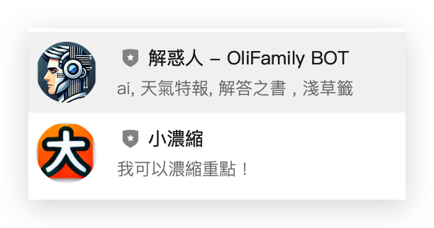

## Public 對外公開

### HuggingFace Space
- [Stock Predict Prophet 世界股價預測 (Prophet + BBands)](https://huggingface.co/spaces/tbdavid2019/Stock-Predict-Prophet)
- [TwStock Predict LSTM 台灣股市的股價預測 (LSTM)](https://huggingface.co/spaces/tbdavid2019/twStock-predict)
- [世界 潛力股列表 (LSTM)](https://huggingface.co/spaces/tbdavid2019/twStock-Underdogs)
- [K線辨識 61 種](http://git-gl.david888.com:5678/)
- [語音轉文字 STT (Whisper)](https://huggingface.co/spaces/tbdavid2019/whisper-stt)
- [製作 Podcast 工具 (Whisper)](https://huggingface.co/spaces/tbdavid2019/PDF2podcast)
- [便利商店即期品](https://huggingface.co/spaces/tbdavid2019/taiwan-7-11) 

### HuggingFace AI Assistant
- [旅行規劃器](https://hf.co/chat/assistant/67bf955350053bd731e595d5)
- [塔羅牌問事](https://hf.co/chat/assistant/67bf944374e5a941de177eb4)
- [解釋給十歲的小朋友](https://hf.co/chat/assistant/67bf976a2d25c88b57770597)

### GPTs
- [Oli家: 旅行規劃器](https://chatgpt.com/g/g-JYWDDH5q3-olijia-lu-xing-gui-hua-qi)
- [Oli家: 市場分析報告產生器](https://chatgpt.com/g/g-eKXHQakNe-olijia-shi-chang-fen-xi-bao-gao-chan-sheng-qi)
- [Oli家: 塔羅牌問事](https://chatgpt.com/g/g-wpr0oCOgg-olijia-ta-luo-pai-wen-shi)
- [Oli家: 面試候選人評估器](https://chatgpt.com/g/g-rtNYKsRNe-olijia-mian-shi-hou-xuan-ren-ping-gu-qi)
- [Oli家: 慢思考 CoT](https://chatgpt.com/g/g-AhPpi36JA-olijia-man-si-kao-cot)
- [Oli家: 中英翻譯](https://chatgpt.com/g/g-eyyVrNFXd-olijia-zhong-ying-fan-yi)
- [Oli家: 中文斷詞工具 NLP](https://chatgpt.com/g/g-B2hHXjTET-olijia-zhong-wen-duan-ci-gong-ju-nlp)
- [Oli 家: 面相算命](https://chatgpt.com/g/g-67445071ff3081918c3076ad860be46a-oli-jia-mian-xiang-suan-ming)

### Web 網站服務
- [PDF 工具箱](https://pdf.david888.com)
- [隨機即用記事本](https://wiki.david888.com)
- [GPT](https://gpt.david888.com)
- [TOOL 前端工具箱](https://tool.david888.com)
- [PDF to Podcast](https://huggingface.co/spaces/tbdavid2019/PDF2Audio)

### Chrome Extension（瀏覽器擴充套件 / 插件）
- [小濃縮 (Quick Summary)](https://chromewebstore.google.com/detail/%E5%B0%8F%E6%BF%83%E7%B8%AE-quick-summary/ilgegilcecmgnomacgjiklmhfgioekof?authuser=0&hl=zh-TW)
- [Random GRE Word 隨機單字複習器](https://chromewebstore.google.com/detail/random-gre-word-%E9%9A%A8%E6%A9%9F%E5%96%AE%E5%AD%97%E8%A4%87%E7%BF%92%E5%99%A8/mpbkdjjihhjjhmlnchkbpgfclhhdblap?hl=zh-TW&utm_source=ext_sidebar)
- [改字體 (Font Changer)](https://chromewebstore.google.com/detail/%E6%94%B9%E5%AD%97%E9%AB%94-font-changer/ilmdkfomedcdolkiiagifgmgohahlmoi?authuser=0&hl=zh-TW)

### Telegram
- [小截圖](https://t.me/oli_img_bot)
- [小濃縮](https://t.me/quantaar_bot)
- [股靈精怪 (股票)](https://t.me/oli_billion_bot)

### Line
- [解惑人](https://liff.line.me/1645278921-kWRPP32q/?accountId=728wsrjq)
- [小濃縮](https://liff.line.me/1645278921-kWRPP32q/?accountId=032trcev)



### API

#### Book of Answers API (Traditional Chinese)  
**解答之書 API（繁體中文）**:
```shell
curl http://answerbook.david888.com/
````

**Book of Answers API (English)**

  ```
curl http://answerbook.david888.com/en
  ```

**解答之書 API（英文）**:

```
curl http://answerbook.david888.com/?lang=en
```

**Random Password Generator隨機密碼產生器**:

```
curl http://answerbook.david888.com/RandomPassword
```

**Random Tang Poetry API隨機唐詩 API**:
```
curl http://answerbook.david888.com/TangPoetry
```

**Random Temple Oracle API (Japanese)隨機淺草籤 API**:

```
curl http://answerbook.david888.com/TempleOracleJP
```

**Random GRE Words API 隨機 GRE 單字 API**:

```
curl http://answerbook.david888.com/greWord
```


**不對外公開，私人用 Private**

  **Telegram**

• [@oli_cerebrum_bot](https://t.me/oli_cerebrum_bot)
• [@oli_cerebellum_bot](https://t.me/oli_cerebellum_bot)
• [@olifamily_bot](https://t.me/olifamily_bot)

  

**HuggingFace Space**

• [潛力股 完整版](https://huggingface.co/spaces/tbdavid2019/Stock-Underdogs)
• [LLM2 - liberchat](https://huggingface.co/spaces/tbdavid2019/liberchat)

  

**Vercel**
• [LLM3 - nextChat](https://llmchat-rouge.vercel.app)

  

**Colab**
• [Whisper 轉錄逐字稿 + Gemini 會議總結](https://colab.research.google.com/drive/1nO918SBJZngMcaIzGjykOKqDTQ_T21yD)
• [新聞爬蟲](https://colab.research.google.com/drive/1HwFJLTXo0UWRhMrP3N2M4XgBILfzrCaA)
• [股市預測](https://colab.research.google.com/drive/1V30GA2wpWe2Twj7XWUZ2VLZQRYNnXZdQ)
• [Whisper for Youtube](https://colab.research.google.com/drive/126dSU8YASThWZHJ2ZEytbBBVowgLYuwu?authuser=1#scrollTo=m9g1Kyj7DkbQ)
